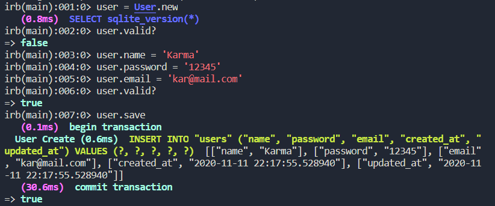
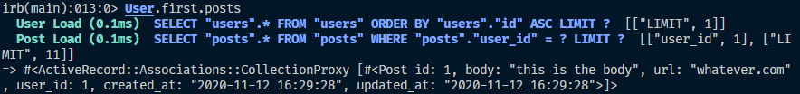
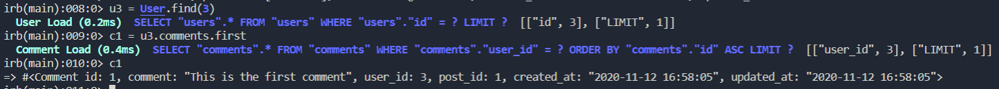

# Micro reddit

> Made as a practice for Active Record in rails. The app works in the rails console and allows the user to play with the relations between comments, posts and users.

## Built With

- Ruby
- Ruby on rails
- SQLite3

## Authors

👤 **Khristian Rojas**

- Github: [@githubhandle](https://github.com/karmaester)
- Twitter: [@twitterhandle](https://twitter.com/karmaendlich)
- Linkedin: [linkedin](https://www.linkedin.com/in/khristian-rojas/)

👤 **Kevin Cotrina**

- Github: [@githubhandle](https://github.com/kcotrinam)
- Twitter: [@twitterhandle](https://twitter.com/KevinCot12)
- Linkedin: [linkedin](https://www.linkedin.com/in/kevin-cotrina-6208b7149/)

## 🤝 Contributing

Contributions, issues and feature requests are welcome!

Feel free to check the [issues page](https://github.com/kcotrinam/micro-reddit/issues).

## Show your support

Give a ⭐️ if you like this project!

## Acknowledgments

- The Odin Project
- Rails guides
- Microverse

## 📝 License

This project is [MIT](lic.url) licensed.
